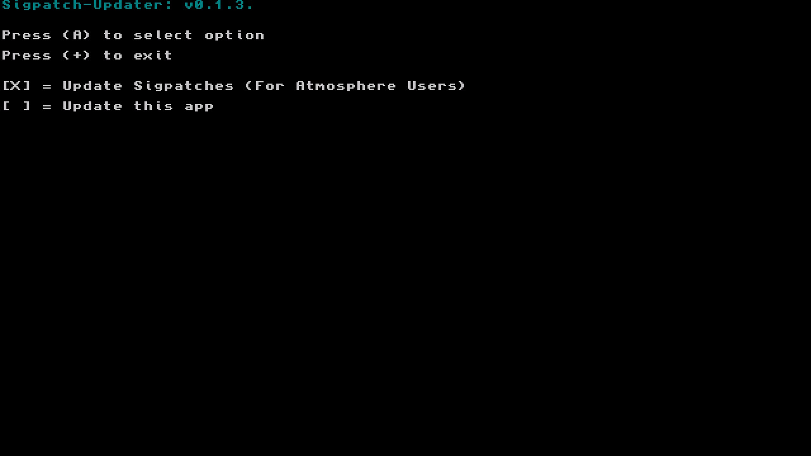

# Sigpatch-Updater

This is a updater for your sigpatches! Currently it has the option to:

* Download patches needed for Atmosphere

----

## Where does it download the patches from?

The patches are download from my [patches repo](https://github.com/eXhumer/patches). These are automatically updated from the sources below.

The Atmosphere patches are downloaded from [this gbatemp thread](https://gbatemp.net/threads/i-heard-that-you-guys-need-some-sweet-patches-for-atmosphere.521164/) which has proven to be the most trusted source for patches.

----

## Special Thanks!

[iTotalJustice](ITotalJustice) for originally developing the app.

[toph](https://github.com/sudot0ph) for the design of the app icon!

The-4n for continuing to update the sigpatch thread of gbatemp!